# Python-Django-商品库存交易管理系统

该项目是一个基于Python-Django框架的商品库存交易管理系统，实现了用户注册、登录、登出、个人信息管理、员工管理、商品管理、订单管理等功能。

该项目已经部署在云服务器上，可以通过以下链接访问：[商品库存交易管理系统](http://alist.irikka.com:10086)

账号：guest
密码：N$sv!M8%L-WyH&~

## 系统概览

### 主页

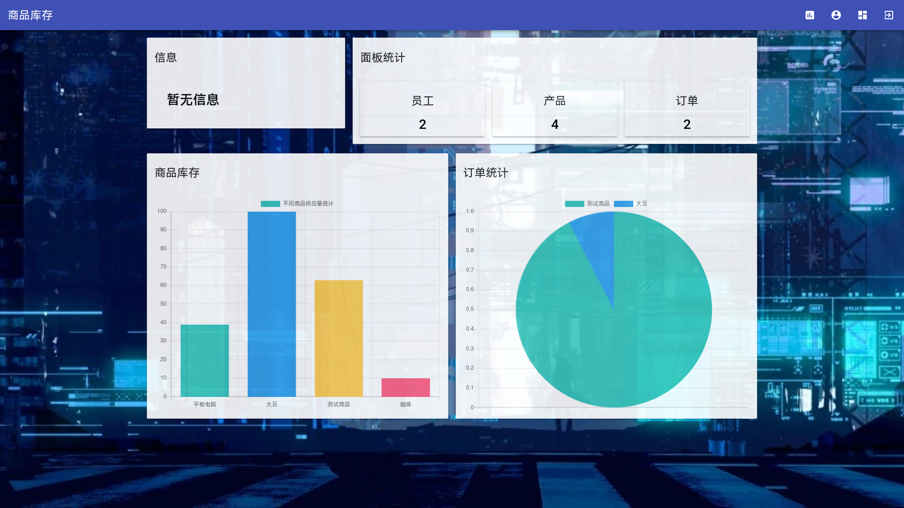

### 后台管理

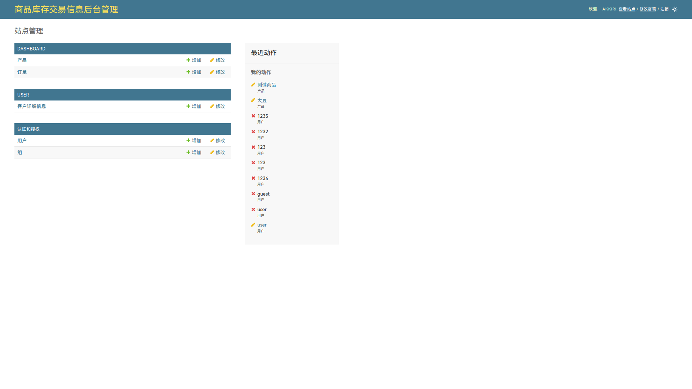

### 登录

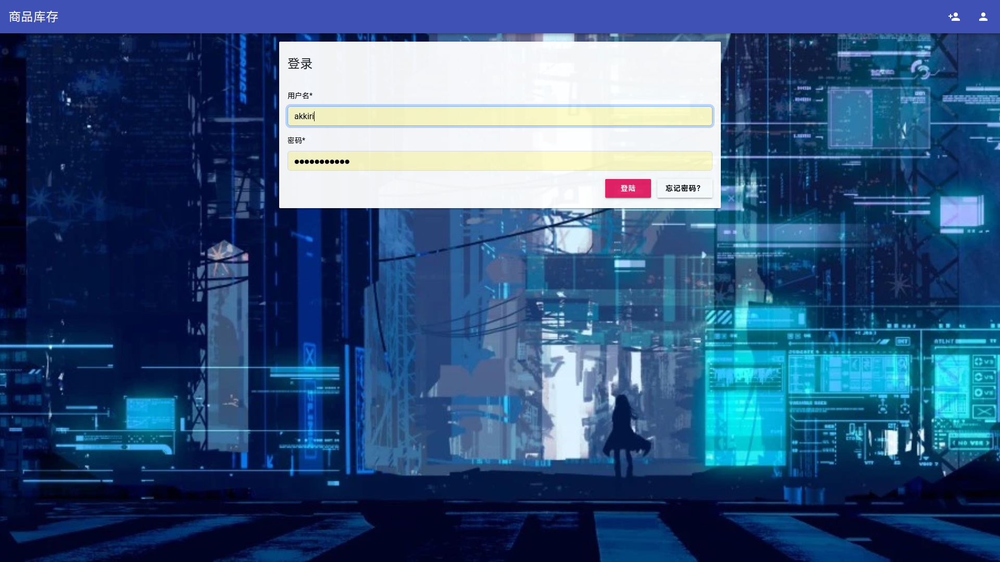

### 注册

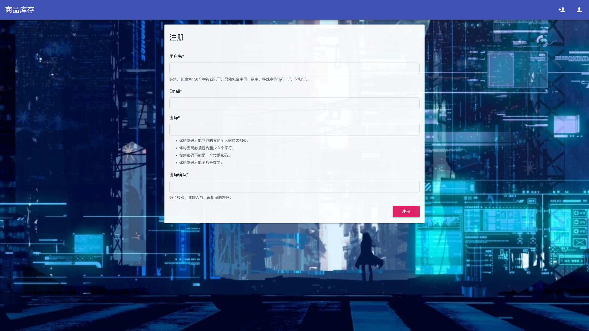

### 登出

### 个人信息

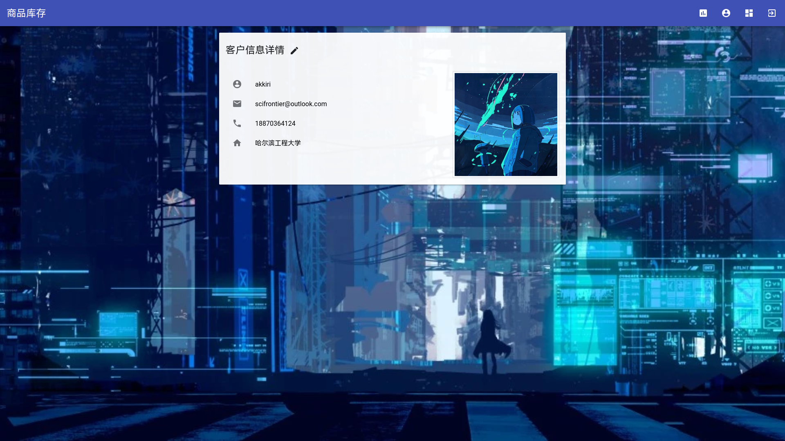

### 个人信息编辑

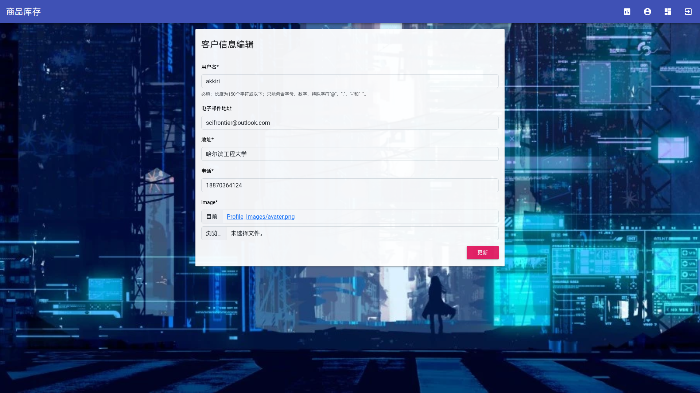

### 员工列表

### 商品管理

### 添加商品

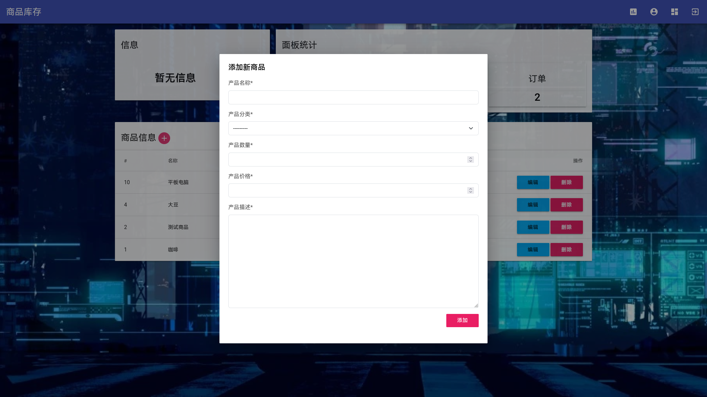

### 更新商品

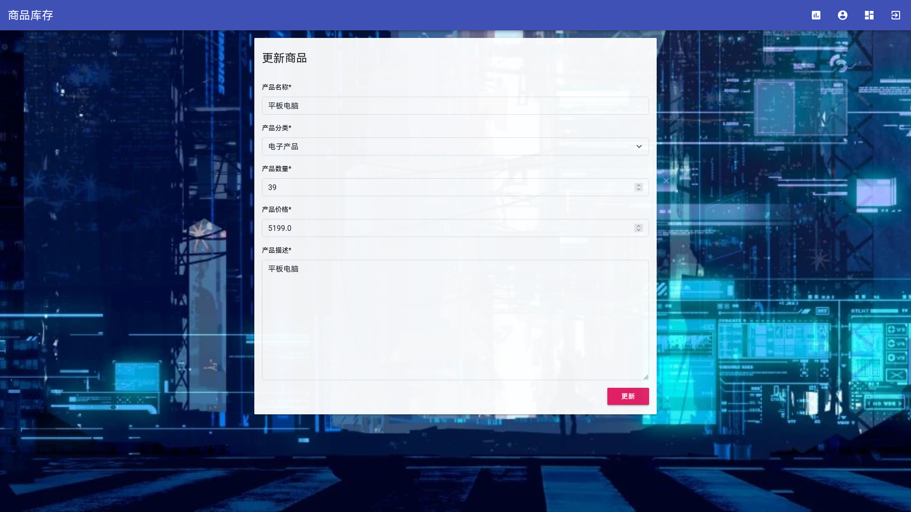

### 删除商品

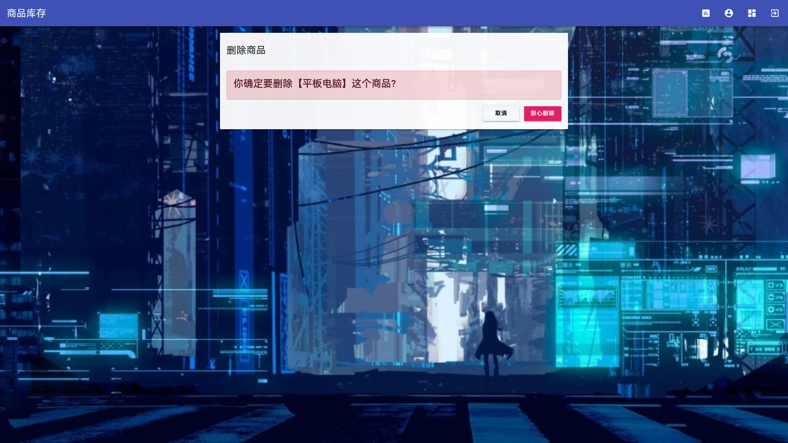

### 消息提示

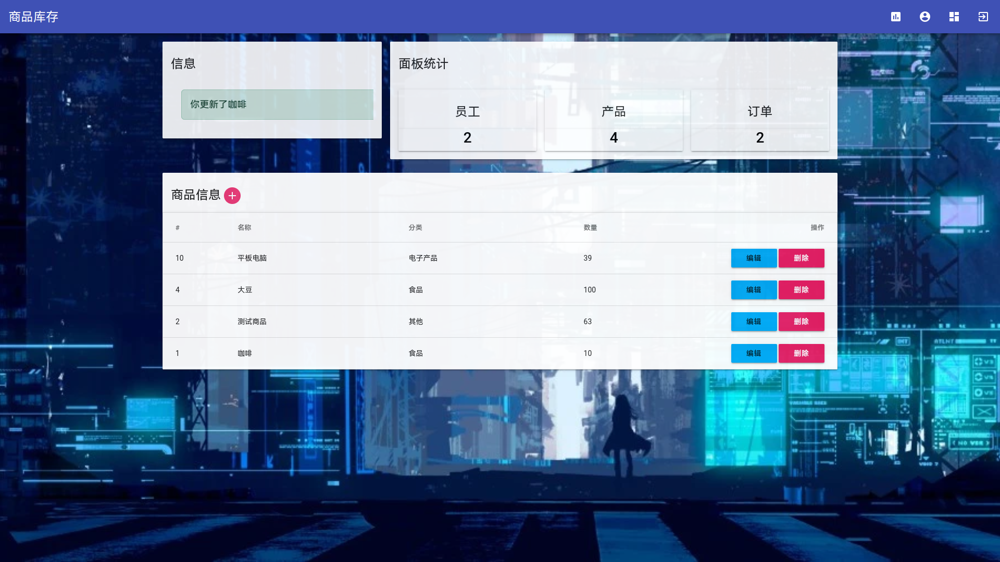

### 订单列表

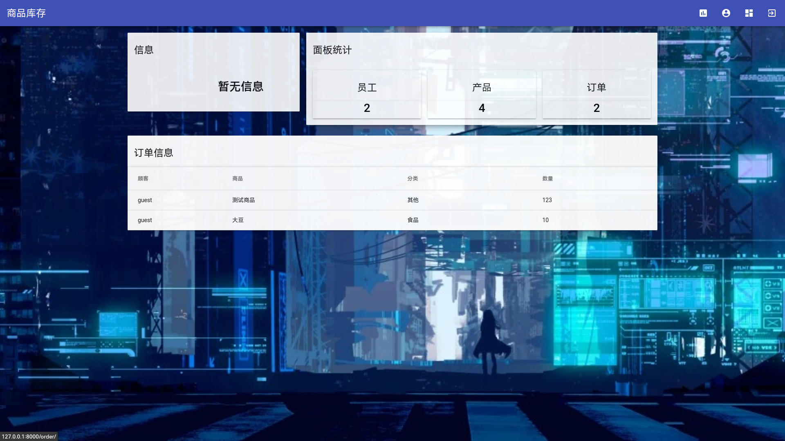

### CRUD-订单管理

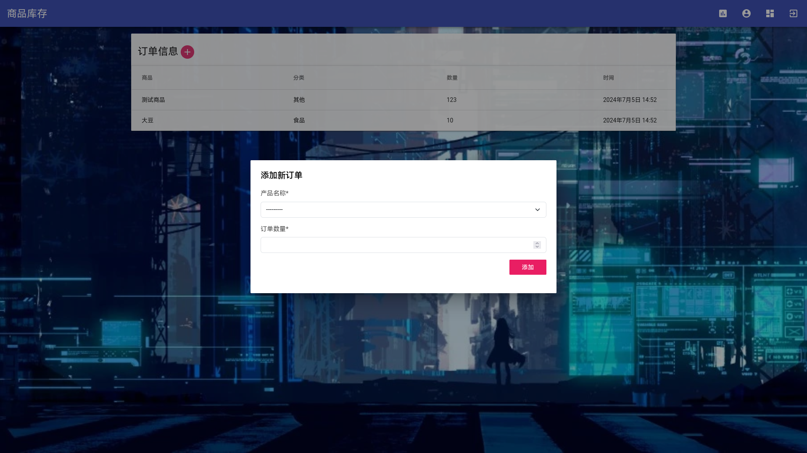